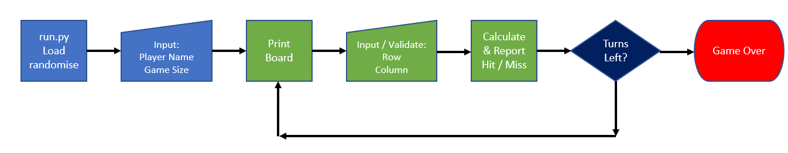

Welcome to my very very first Python Project!

This project is part of the learning material for Code Institute's Fullstack Web Developer program.

It's taken a lot of experimentation, trial, and at times, mostly error.  

You can check it out on Heroku [here](https://battleshipsjk2.herokuapp.com/)

## Project Description

This project was created in order to get familiar with common development tools like Git & GitHub, and how to use them to write and manage python code. 

Current game set to 8*8 board, 1 cell ship size and 10 turns.

To play, try to guess the rows & colums (grid reference) that contain enemy ships.

Entering a row and column will fire a missile at the grid reference.

You have 10 missiles / tries to win.

Good luck !!!

### Subject

The classic Battle Ships game.

### Audience

Anyone who likes simple games with a nostalgic retro touch

## Technology

This project was written on github using Python.

Code can be found [here](https://github.com/johnk2022/battleships)

## Code Verified

validator.w3.org - July 2022

jigsaw.w3.org/css-validator - July 2022

## Project Wireframe

## Credits

GitHub for the development tools and website hosting.

Python code taken from taken from YouTuber Knowledge Mavens - excellent tutorials.

CodeInstitute and my fellow students for the assistance, encouragement and general moral boosters.

## Version History

16/07/22 

Initial Commit.

Create code for 8*8 Game, 10 turns.

Deployed to Heroku

Add Player1 name

## Bugs

No validation on player1 variable

## Future Development

Allow player to set board size.

Alow player set the number of turns.

Add multiple ship sizes

## FAQ 

N/A

---

Happy coding!

johnk2022
July 2022